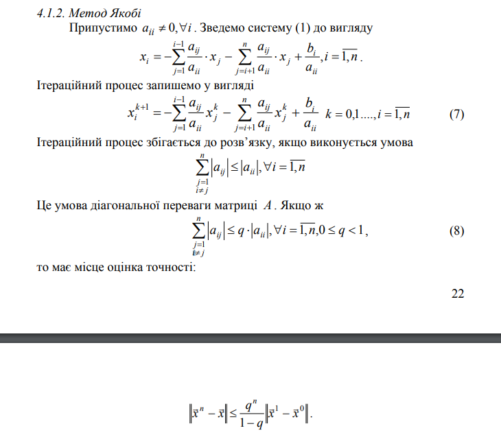

1. LUP decomposition:
https://ru.wikipedia.org/wiki/LUP-%D1%80%D0%B0%D0%B7%D0%BB%D0%BE%D0%B6%D0%B5%D0%BD%D0%B8%D0%B5

LUP-разложение (LUP-декомпозиция) — представление данной матрицы A в виде произведения 
PA = LU где:
- матрица L является нижнетреугольной с единицами на главной диагонали, 
- U — верхнетреугольная общего вида
- P — т. н. матрица перестановок, получаемая из единичной матрицы путём перестановки строк или столбцов.

The goal of partial pivoting is to use a permutation matrix to place the largest entry of the first column of the matrix at the top of that first column
http://www.cfm.brown.edu/people/dobrush/cs52/Mathematica/Part2/PLU.html

2. Метод Якобі

3. Метод Зейделя
https://en.wikipedia.org/wiki/Gauss%E2%80%93Seidel_method#:~:text=In%20numerical%20linear%20algebra%2C%20the,a%20system%20of%20linear%20equations.